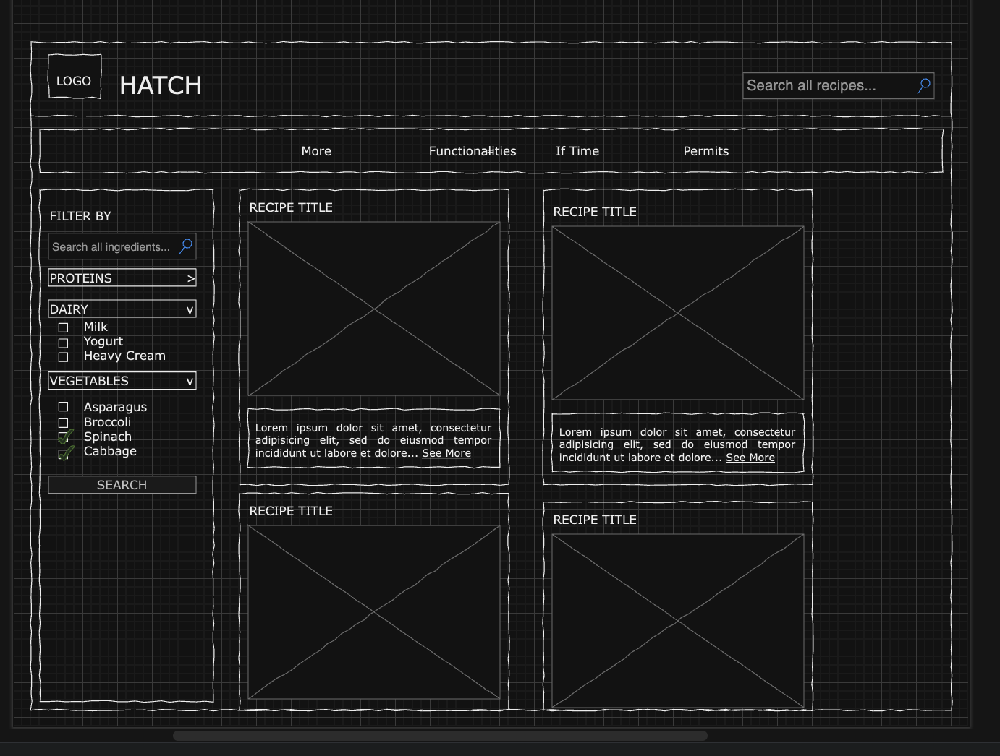
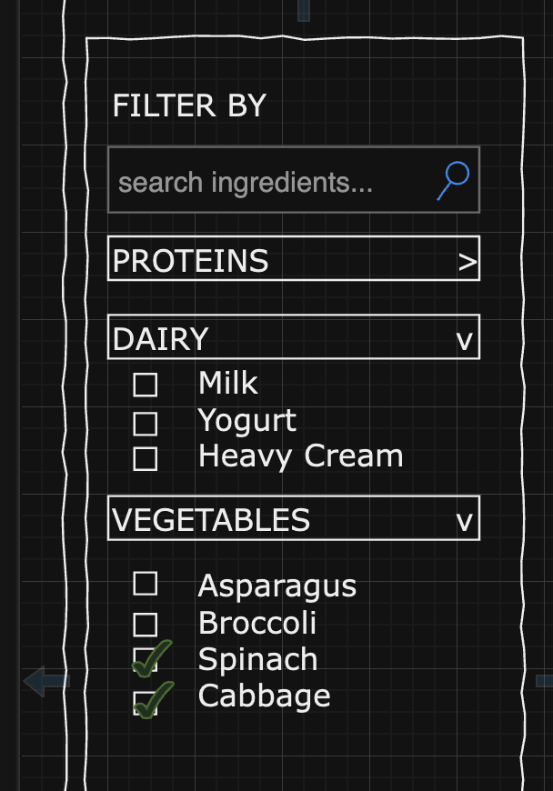
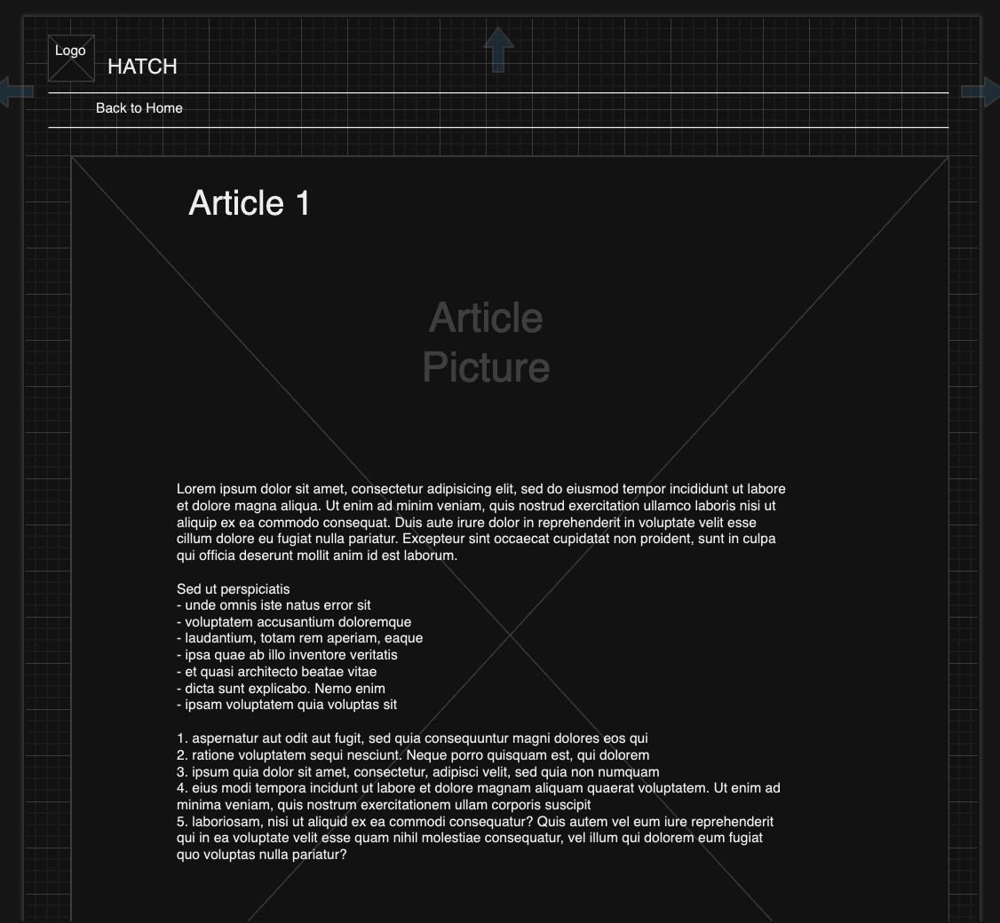

# Hatch
@cucumberpeel

## Overview

Asian Americans, are you tired of making the same few recipes over and over? Can't think of ways to switch up your diet? Introducing Hatch, your personal cooking companion!

Hatch is a web app that will allow users to find Chinese and Korean recipes based on ingredients they select. Users can browse vetted recipes based on tags or filter based on the ingredients they'd like to use.

## Data Model

The application will store Ingredients and Recipes

* Each recipe has a list of references to ingredients
* Ingredients can be repeated across recipes
* Recipes can be doubled, tripled, and so on up to a factor of 5x

An Example Ingredient:

```javascript
{
  name: "soy-sauce",
  category: "seasoning",
  description: "A salty sauce made with fermented soybeans."
}
```

An Example Recipe:

```javascript
{
  name: "Tteokbokki",
  altName: "떡볶이",
  prepTime: 15,
  description : "Chewy rice cakes cooked in a red, spicy broth.",
  intro : "Tteokbokki (떡볶이) is one of the most popular Korean street foods in Korea. Among other things, today’s recipe is made with Korean rice cakes and gochujang (Korean chili paste)! It’s super delicious, umami rich and highly addictive! So much so that even if your tummy is full, you will still have some room for these spicy rice cakes!",
  ingredients: [
    { name: "water", amt: 4, unit: "cups" },
    { name: "dried-anchovy", amt: 7, unit: "units" },
    { name: "gochujang", amt: 4, unit: "tablespoons" },
    { name: "gochugaru", amt: 1, unit: "tablespoons" },
    { name: "sugar", amt: 1, unit: "tablespoons" },
    { name: "scallion", amt: 3, unit: "stalks" },
    { name: "egg", amt: 2, unit: "units" },
    { name: "soy-sauce", amt: 0.5, unit: "tablespoons" },
    { name: "rice-cake", amt: 0.5, unit: "pounds" }
    ],
  steps: [
    "Add the water, dried anchovies, and dried kelp to a shallow pot or pan.",
    "Boil for 15 minutes over medium high heat without the lid.",
    "In a separate pot, boil the eggs for 7-8 minutes, or longer if preferred.",
    "Combine gochujang (hot pepper paste), gochugaru (hot pepper flakes), and sugar in a small bowl. Remove the anchovies from the pot and add the rice cake, the mixture in the bowl, the green onion, and hard boiled eggs.",
    "Stir gently with a wooden spoon when it starts to boil. Let it simmer and keep stirring until the rice cake turns soft and the tteokbokki sauce thickens and looks shiny, which should take about 10 to 15 minutes. If the rice cake is not soft enough, add more water and continue stirring until it softens.",
    "Remove from the heat and serve hot. Add cheese and/or parsley flakes if desired."
  ]
}
```

## [Link to Commented First Draft Schema](db.mjs)

## Wireframes

/ - page for showing all recipes



/recipe?query - menu for filtering recipes by name or ingredient



/recipe/slug - page for showing one specific recipe



/ingredient/slug - page for showing one specific ingredient

## Site map


## User Stories or Use Cases

1. as a user, I can view all the recipes on the site
2. as a user, I can filter the recipes on the site by ingredients
3. as a user, I can search for a recipe on the site by name
4. as a user, I can read an individual recipe
5. as a user, I can view an individual ingredient

## Research Topics

* (3 points) Configuration management
* (2 points) Bootstrap theme
    * Shop Homepage
* (4 points) client-side Javascript library
    * Animate on Scroll: detects element positions as they appear in the viewport to add classes to animate the site as a user scrolls

10 points total out of 10 required points


## [Link to Initial Main Project File](app.mjs) 

## Annotations / References Used

1. [aos.js](https://github.com/michalsnik/aos)
2. [Bootstrap theme](https://startbootstrap.com/template/shop-homepage)

