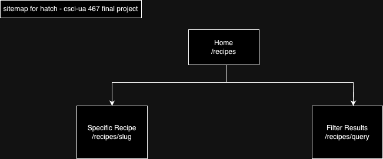

# Hatch
Amory Gao
@cucumberpeel

## Overview

Tired of making the same few recipes over and over? Can't think of ways to switch up your diet? Introducing Hatch, your personal cooking companion!

Hatch is a web app that will allow users to find recipes based on ingredients they select. Users can browse vetted recipes based on tags or filter based on the ingredients they'd like to use.

## Data Model

The application will store Ingredients and Recipes

* Each recipe has a list of references to multiple Ingredients
* Ingredients can be repeated across recipes
* Will add more functionalities (e.g. tags, doubling/tripling recipes, etc.) if time permits

An Example Ingredient:

```javascript
{
  name: "soy sauce",
  altName: [{ "간장", "酱油" }]
  category: "condiment"
}
```

An Example Recipe:

```javascript
{
  name: "Tteokbokki",
  altName: "떡볶이",
  prepTime: 15,
  description : "Chewy rice cakes cooked in a red, spicy broth.",
  ingredients: [
    { name: "gochujang", quantity: 1.5, unit: "tablespoon" },
    { name: "gochugaru", quantity: 1.5, unit: "tablespoon" },
    { name: "soy sauce", quantity: 0.5, unit: "tablespoon" },
    { name: "rice cake", quantity: 0.5, unit: "pound" }
    ] // array of references to Ingredient documents
}
```

## [Link to Commented First Draft Schema](db.mjs)

## Wireframes

/recipes - page for showing all recipes


/recipes/query - menu for filtering recipes by query


/recipes/slug - page for showing one specific recipe


## Site map



## User Stories or Use Cases

1. as a user, I can view all the recipes on the site
2. as a user, I can filter the recipes on the site by ingredients
3. as a user, I can read an individual recipe
4. as a user, I can go back to my previous query results after reading an individual recipe
5. as a user, I can clear my query

## Research Topics

* (2? points) client-side Javascript library
    * Animate on Scroll: detects element positions as they appear in the viewport to add classes to animate the site as a user scrolls
* (2? points) server-side Javascript library
    * Next.js
* (6 points) React
    * Planning to use React as frontend framework

10 points total out of 10 required points


## [Link to Initial Main Project File](app.mjs) 

## Annotations / References Used

1. [aos.js](https://github.com/michalsnik/aos)
2. [React.js tutorial](https://youtu.be/bMknfKXIFA8?si=xrV22t07Hnd49Stj)
3. [Next.js tutorial](https://nextjs.org/learn?utm_source=next-site&utm_medium=homepage-cta&utm_campaign=home)

